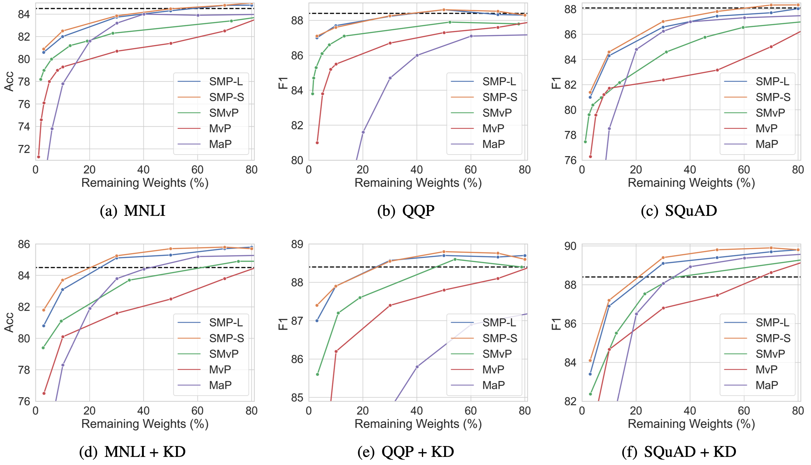

# Pruning Pre-trained Language Models Without Fine-Tuning

## Overview
In this work, we argue fine-tuning is redundant for first-order pruning, since first-order pruning is sufficient to converge PLMs to downstream tasks without fine-tuning. Under this motivation, we propose Static Model Pruning (SMP), which only uses first-order pruning to adapt PLMs to downstream tasks while achieving the target sparsity level.

Results of SMP compared with soft-movement pruning (SMvP), movement pruning (MvP) and magnitude pruning (MaP):


<br />

SMP-S significantly outperforms movement pruning even without fine-tuning language model. 

<table align="center">
<thead>
<tr>
<th align="center">Task</th>
<th align="center">BERT<br>base</th>
<th align="center">Remaining<br>Weights (%)</th>
<th align="center">Soft-Movement</th>
<th align="center">SMP-S</th>
</tr>
</thead>
<tbody>
<tr>
<td align="center">MNLI<br>acc/MM acc</td>
<td align="center">84.5/84.9</td>
<td align="center">50%<br>10%<br>3%</td>
<td align="center">-<br>81.2/81.8<br>79.5/80.1</td>
<td align="center"><a href="https://github.com/kongds/SMP/releases/download/SMP-S/mnli_0.50_kd_mag.npy.zip">85.7/85.5</a> <br><a href="https://github.com/kongds/SMP/releases/download/SMP-S/mnli_0.10_kd_mag.npy.zip">83.7/83.6</a><br><a href="https://github.com/kongds/SMP/releases/download/SMP-S/mnli_0.03_kd_mag.npy.zip">81.8/82.0</a></td>
</tr>
<tr>
<td align="center">QQP<br>acc/F1</td>
<td align="center">91.4/88.4</td>
<td align="center">50%<br>10%<br>3%</td>
<td align="center">-<br>90.2/86.8<br>89.1/85.5</td>
<td align="center"><a href="https://github.com/kongds/SMP/releases/download/SMP-S/qqp_0.50_kd_mag.npy.zip">91.7/88.8</a><br><a href="https://github.com/kongds/SMP/releases/download/SMP-S/qqp_0.10_kd_mag.npy.zip">91.0/87.9</a><br><a href="https://github.com/kongds/SMP/releases/download/SMP-S/qqp_0.03_kd_mag.npy.zip">90.5/87.4</a></td>
</tr>
<tr>
<td align="center">SQuAD<br>EM/F1</td>
<td align="center">80.4/88.1</td>
<td align="center">50%<br>10%<br>3%</td>
<td align="center">-<br>76.6/84.9<br>72.7/82.3</td>
<td align="center"><a href="https://github.com/kongds/SMP/releases/download/SMP-S/squad_0.50_kd_mag.npy.zip">82.8/89.8</a><br><a href="https://github.com/kongds/SMP/releases/download/SMP-S/squad_0.10_kd_mag.npy.zip">79.3/87.2</a><br><a href="https://github.com/kongds/SMP/releases/download/SMP-S/squad_0.03_kd_mag.npy.zip">75.0/84.1</a></td>
</tr>
</tbody>
</table>

## Setup
### Install Dependencies

``` sh
pip install -r requirements.txt
```

### Teacher Models

For GLUE, we use same teacher models with movment-pruning, which can been download in  [dynabert](https://drive.google.com/file/d/1pYApaDcse5QIB6lZagWO0uElAavFazpA/view?usp=sharing).

For SQuAD, we fine tuned `bert-base-uncased` on SQuAD as the teacher model, which can been download in [here](https://drive.google.com/file/d/15zLGpdTrBlChjc_lYBJu3tln-YS1dzTW/view?usp=sharing).

## Evaluation

We've released SMP-S checkpoints with Knowledge Distillation (KD) for MNLI, QQP, and SQuAD tasks. You can download the checkpoints from our [release page](https://github.com/kongds/SMP/releases/tag/SMP-S).

To download and evaluate the checkpoints on the corresponding tasks, simply run the following command:

```bash
bash eval.sh mnli_0.50_kd_mag
```

This command will download the checkpoint `mnli_0.50_kd_mag` from [release page](https://github.com/kongds/SMP/releases/tag/SMP-S) and evaluate it on the MNLI.

## Pruning 
### GLUE

To perform pruning on a GLUE task, run the command: `bash run.sh <task>_<sparsity>[_kd][_mag]` 
   - Replace `<task>` with the GLUE task name (mnli, qnli, qpp, sst2, mrpc, cola, stsb, or rte)
   - Replace `<sparsity>` with the desired sparsity level (0.03, 0.10, 0.30, 0.40, 0.50, 0.70, or 0.80).
   - Add `_kd` if you want to use knowledge distillation.
   - Add `_mag` if you want to use SMP-S instead of SMP-L.

For example, to prune on the MNLI task with 0.03 sparsity, knowledge distillation and SMP-S, run the following command:
``` bash
bash run.sh mnli_0.03_kd_mag 
```

### SQuAD
To perform pruning on SQuAD, run the command: `bash run_squad.sh <task>_<sparsity>[_kd][_mag]` 


## Acknowledgement
Our Code is based on movement-pruning
